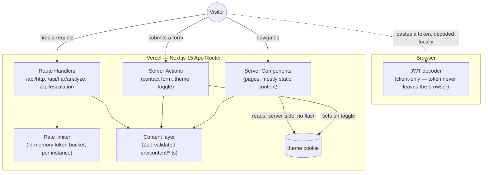

# kyleagostinelli.github.io

My personal site: [kyleagostinelli.vercel.app](https://kyleagostinelli.vercel.app/). Built to
do two things at once — read like a normal portfolio to a hiring manager in 90 seconds, and
hold up to a technical reviewer who clones the repo and starts opening files.

I'm targeting Technical Support Engineer / Support Specialist II roles. The site's argument
for that is a real incident write-up (`/work`) and a set of diagnostic tools (`/tools`) built
as actual server-side route handlers, not screenshots of what they'd do.

## The stack, and why

**Next.js 15 (App Router) + TypeScript strict + Tailwind v4, deployed to Vercel.**

- **Next.js on Vercel, not a static site.** The diagnostic tools in `/tools` are real
  `app/api/*/route.ts` handlers with Zod validation, rate limiting, and real HTTP status
  codes — the entire reason this isn't a Vite SPA. A static export would mean disabling every
  server feature the site actually demonstrates, which defeats the point of building them.
- **TypeScript strict, everywhere.** `strict`, `noUncheckedIndexedAccess`,
  `noImplicitOverride`, `exactOptionalPropertyTypes`. Zero `any`, zero `@ts-ignore`.
- **Zod at every trust boundary.** Content modules, `process.env`, route handler input, HAR
  file parsing, MDX frontmatter — each is validated once, with the TypeScript type derived
  from the schema (`z.infer`) rather than hand-duplicated.
- **Tailwind v4 with a real token layer**, not utility soup. Colors are OKLCH, contrast is
  verified programmatically (`src/lib/color-contrast.ts` + `src/styles/palette.test.ts`), not
  eyeballed.
- **Previously a Vite + React SPA** on GitHub Pages. `docs/DECISIONS.md` has the five ADRs
  behind the rewrite; `docs/ARCHITECTURE.md` has the original migration plan.

## Running it locally

```bash
npm install
npm run dev
```

Copy `.env.example` to `.env.local` if you want the contact form to send through Formspree
instead of falling back to a `mailto:` link:

```bash
FORMSPREE_ENDPOINT=https://formspree.io/f/YOUR_FORM_ID
```

## Checks

```bash
npm run typecheck      # tsc --noEmit
npm run lint            # eslint, strict type-checked config
npm run format:check    # prettier
npm run test             # vitest — unit + component tests
npm run build            # next build
npm run bundle-size      # gzipped First Load JS per route vs. committed baseline
npm run test:e2e         # playwright — functional e2e + accessibility, all 3 engines
```

## How it's tested

- **Unit (Vitest).** Every content schema, every parser and formatter from the diagnostic
  tools, every route handler (success, validation failure, rate limit), the theme toggle's
  server action, and a React Testing Library test for the one component with real client-side
  interaction (`MobileNav` — open/close, focus trap, `Escape` to close).
- **E2E (Playwright, Chromium + Firefox + WebKit).** Primary navigation, the contact form
  (success and validation failure), each diagnostic tool's happy path, keyboard-only
  navigation of the mobile menu, and both color schemes. WebKit needed real keystroke
  simulation instead of `fill()` for two of the controlled-textarea tools — documented inline
  in `tests/e2e/tools.spec.ts` — because WebKit doesn't dispatch the input event those
  components' `onChange` handlers need when `fill()` sets the value directly.
- **Accessibility (`@axe-core/playwright`).** Every real route, light and dark, asserting zero
  serious-or-critical violations. Scans run with `prefers-reduced-motion: reduce` so a
  first-paint fade animation doesn't get measured mid-transition and reported as a false
  contrast failure.
- **Performance (Lighthouse CI, `lighthouserc.json`).** Enforced budgets: Performance ≥ 98,
  Accessibility/Best Practices/SEO = 100, CLS < 0.01, LCP < 1.2s simulated. The build fails on
  a missed budget.
- **Bundle size.** `scripts/check-bundle-size.js` computes real gzipped First Load JS per
  route from `.next/app-build-manifest.json` and fails CI on regression past 5% (or 2KB,
  whichever is larger) against the committed `bundle-budget.json`.

## How it deploys

Production is Vercel, building straight from `main`. `.github/workflows/ci.yml` runs
typecheck → lint → unit → build → bundle size → e2e → accessibility → Lighthouse on every
push and PR.

`kyleagostinelli.github.io` (GitHub Pages) is a redirect only —
`gh-pages-redirect/index.html`, deployed by `.github/workflows/deploy.yml` — so the URL
already on my resume forwards to the real site instead of 404ing. GitHub Pages can't run this
app's server-side pieces (route handlers, server actions, cookie-based theme) at all; it was
never a candidate for the real deployment.

## Notable implementation details

A few things I'd point a reviewer at first:

1. **The diagnostic tools are real, not simulated.** `/api/http/:status` fires an actual
   `Response` with that status code and inspects the real headers that came back — including
   the fact that a `Response` constructor physically cannot carry a body for 204/205/304 or
   any 1xx status, which the HTTP status tool works around with a header-encoded payload
   instead of pretending the constraint doesn't exist (`app/api/http/[status]/route.ts`).
2. **The JWT decoder never sends the token anywhere.** It's the one tool implemented as a pure
   client module rather than a route handler, on purpose — a token decoder that POSTs your
   token to a server to prove it doesn't need the server is a contradiction. Stated explicitly
   in the UI, not just in a comment (`src/lib/jwt/decode.ts`).
3. **The escalation formatter generates my actual format**, not a generic SEV-template. It
   mirrors how I actually write a ticket up before handing it to L2: log it fully as if solving
   it directly, then transfer, with a pre-transfer note only if something specific needs
   flagging (`src/lib/escalation/format.ts`).
4. **The theme toggle is a server action with no client JS at all** — a
   `<form action={toggleTheme}>` that flips a cookie and re-renders server-side, so there's no
   flash-of-wrong-theme to fix on mount because there was never a client-side guess to correct
   (`src/components/layout/ThemeToggle.tsx`, `src/components/layout/theme-actions.ts`).
5. **A real nonce-based CSP with no `unsafe-inline` for scripts** (`middleware.ts`), verified by
   actually loading the site in a headless browser and checking for zero console violations,
   not just by writing the header and assuming it works. That check caught a real
   cross-engine bug: `upgrade-insecure-requests` breaks WebKit specifically on plain-HTTP
   `localhost`, since WebKit — unlike Chromium and Firefox — doesn't exempt `localhost` from
   the forced HTTPS upgrade. Dropped the directive; HSTS already covers production.

## Architecture



`docs/ARCHITECTURE.md` has the original Phase 0 directory-structure plan and the full
server/client component boundary table; `docs/DECISIONS.md` has the ADRs behind each major
choice above.

## Contact form

Posts through a server action (`app/contact/actions.ts`). If `FORMSPREE_ENDPOINT` is set, it
forwards there; otherwise it redirects to a prefilled `mailto:` link, and says so in the UI
rather than silently failing. A honeypot field and a minimum time-to-submit check
(`app/contact/schema.ts`, `app/contact/submit-contact-form.ts`) report fake success to
anything that looks automated, without sending real spam through to Formspree or my inbox.

## SEO and metadata

Every route has real per-page metadata (title, description, canonical URL, OpenGraph, Twitter
card) built by `src/lib/metadata.ts`, not inherited by accident from the root layout's
defaults. OG images are generated per-route via `next/og` (`app/opengraph-image.tsx`,
`app/work/[slug]/opengraph-image.tsx`), not static PNGs. JSON-LD structured data
(`src/components/JsonLd.tsx`) covers `Person` on the homepage, `BreadcrumbList` on every
nested route, and `TechArticle` on the case study and notes. `sitemap.ts`, `robots.ts`,
`manifest.ts`, and a generated favicon set (`app/icon.tsx`, `app/apple-icon.tsx`) round it out.

## Security

A strict Content-Security-Policy with a per-request nonce (`middleware.ts`, no `unsafe-inline`
for scripts), plus HSTS, `X-Content-Type-Options`, `X-Frame-Options`, `Referrer-Policy`, and
`Permissions-Policy` (`next.config.ts`). See [SECURITY.md](SECURITY.md) for the reporting
process and the documented, accepted limitations (rate limiting is per-instance in-memory; the
JWT decoder has no server-side attack surface by design).
